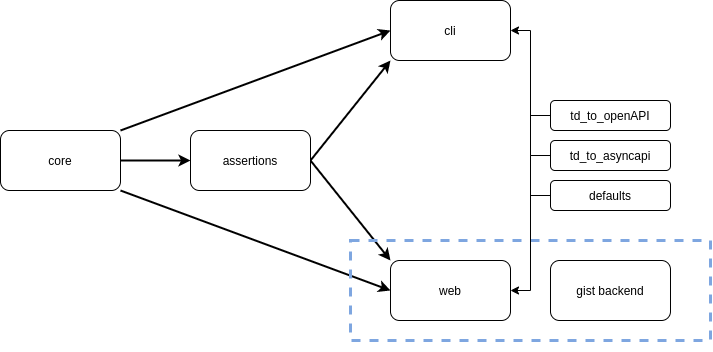

# W3C Web of Things - Thing Description Playground

Try it online at [http://plugfest.thingweb.io/playground/](http://plugfest.thingweb.io/playground/)

## Installation

There are different ways to use Playground:

-   Install all packages and their dependencies via `npm install` in the root directory. This script calls `lerna bootstrap`.
-   You can install the different packages from npm ([see below](./packages)) or in their respective directories.

## Structure

The structure of all Web of Things (WoT) Playground packages is shown here: 

All packages (except CLI and Web) are designed to be used as an imported package in a Node.js project or as a web bundle in a Web application.
This allows them to be used in the Web package as part of a Web UI or inside the CLI.

-   The core package provides a function to check whether a Thing Description (TD) is valid according to the W3C WoT [Thing Description standard](https://w3c.github.io/wot-thing-description/#).
    It uses the official JSON Schema plus additional scripts for aspects which cannot be checked with a JSON Schema alone.
    Used together with the assertions package, it allows to check whether all of the features of the TD standard are present in a single TD or a group of TDs representing an implementation.

Both packages are used by the Web and CLI packages to provide their functionalities, plus IO functionalities through an UI.

## Packages

The packages in this repository are available under ([packages folder](./packages)) or on NPM under [@thing-description-playground/packageName](https://www.npmjs.com/search?q=%40thing-description-playground).

Reusable packages:

-   [core](./packages/core/): The core package provides a function to check whether a Thing Description (TD) is valid according to the W3C WoT [Thing Description standard](https://w3c.github.io/wot-thing-description/#).
    It uses the official JSON Schema plus additional scripts for aspects which cannot be checked with a JSON Schema alone. It generates a JSON report of the validation results. [NPM](https://www.npmjs.com/package/@thing-description-playground/core).
-   [assertions](./packages/assertions/): The assertions package allows to check whether all of the features of the TD standard are present in a single TD or a group of TDs representing an implementation. It needs to be used together with the core package since some features are detected by the core package. [NPM](https://www.npmjs.com/package/@thing-description-playground/assertions).
-   [defaults](./packages/defaults/): The defaults package can be used to add or remove explicitly stated default values in a TD. It has no dependency to other playground packages. [NPM](https://www.npmjs.com/package/@thing-description-playground/defaults).
-   [td_to_openAPI](./packages/td_to_openAPI): The Open API package allows to create an Open API instance from a Thing Description which has HTTP in the forms. It has no dependency to other playground packages.[NPM](https://www.npmjs.com/package/@thing-description-playground/td_to_openapi).
-   [td_to_asyncAPI](./packages/td_to_openAPI): The Async API package allows to create an Async API instance from a Thing Description which has MQTT in the forms. It only depends on the defaults package to add defaults to a TD before generating the Async API instance. [NPM](https://www.npmjs.com/package/@thing-description-playground/td_to_asyncapi).
-   [json-spell-checker](./packages/json-spell-checker): The JSON Spell Checker package allows to find spelling mistakes (e.g. action instead of actions) in a JSON document according to its JSON Schema. Such JSON documents could be TDs, Open API specs etc. [NPM](https://www.npmjs.com/package/@thing-description-playground/json-spell-checker).

End Product Packages:

-   [cli](./packages/cli/): The CLI package wraps the above packages in way they can be used from the command line. Additionally, it allows the functionalities of the other packages to be executed on a set of TDs. [NPM](https://www.npmjs.com/package/@thing-description-playground/cli).
-   [web](./packages/web/): The Web package wraps the above packages in way they can be used from a browser interface. You can host/adapt your own browser version of the playground. It is online at [http://plugfest.thingweb.io/playground/](http://plugfest.thingweb.io/playground/)[NPM](https://www.npmjs.com/package/@thing-description-playground/web).

## Examples

Examples are included in the [core](./packages/core/examples) and in the [examples folder](./examples) in the root of the project.

## Browser based Thing Description Validation

-   Online: It is hosted [here](http://plugfest.thingweb.io/playground/)

    -   Simply paste a TD in the text field and click validate
    -   Safari browser has unexpected behavior with JSON-LD documents
    -   If you loose your internet connection when validating JSON-LD validation will fail since it tries to access the documents under `@context` (can be turned off)

-   Offline/OnPremise: by hosting the `web` yourself. Therefore, please deliver the "index.html" file with a web-server.

## Batch Testing

Please have a look at the `cli` [package](https://github.com/eclipse/thingweb.td-playground/tree/master/packages/cli#batch-testing) for batch testing of Thing Descriptions.

## Script based Assertion Tester

Please have a look at the `cli` [package](https://github.com/eclipse/thingweb.td-playground/tree/master/packages/cli#script-based-assertion-tester--a-parameter) for script based assertion testing, or at the `assertions` package, if you're planning to integrate the assertion testing as a dependency in your own NPM modules.

## Script based Thing Description Validation

Please have look at the `cli` [package](https://github.com/eclipse/thingweb.td-playground/tree/master/packages/cli#script-based-thing-description-validation) for script based TD validation, or at the `core` package, if you're planning to integrate the TD validation as a dependency in your own NPM modules.

## License

All packages are licensed under the Eclipse Public License v. 2.0. You find a copy of the License [here](./LICENSE.md).

## Publish a new version

1. Run `lerna bootstrap` to install dependencies among the packages, even if a package has never been published before. Make sure you have not increased the dependency versions yet, e.g., you have a new package _newExample_ and the _oldExample_ depends on it. The _newExample_ is on version `0.0.0` (since you want to publish it as `1.0.0`) then in the _oldExample_ package.json the dependency has to be on the same version (or lower) so `"dependencies" { newExample: "^0.0.0"}}`. **Otherwise lerna will not accept linking the local _newExample_.**
2. If `lerna bootstrap` was successful you can now bump dependency versions (if required), e.g., you could now do `"dependencies" { newExample: "^1.0.0"}}` in the _oldExample_ package.json.
3. Run `lerna publish` to publish all new package versions. Lerna will then ask for every changed package whether it received a patch, minor or major update. In our example you should now select major for the _newExample_ so that it will be published as `1.0.0` version. You should login to npm via `npm login` before doing this.
